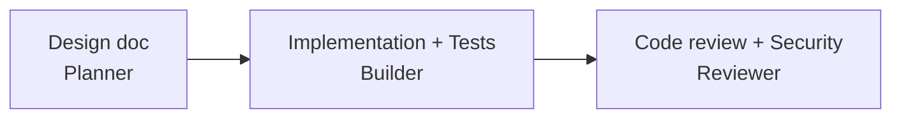

# Backlog Management — Role Routing & Workflows

> This project uses [Backlog.md](https://github.com/MrLesk/Backlog.md) for task tracking.
> Tasks are stored as markdown files in `backlog/tasks/`.
>
> **Templates**: See [Backlog Templates](../../docs/reference/backlog-templates.md) for task templates.

## Agent Assignees

| Assignee    | Role                                              |
| ----------- | ------------------------------------------------- |
| `@builder`  | Code implementation, tests, infrastructure        |
| `@planner`  | Design docs, backlog creation, architecture       |
| `@reviewer` | Code review, security audit                       |

## Dependency Graph

Tasks should have proper blocking relationships:



**Rules:**

- Implementation and test tasks are handled by Builder
- Review task depends on all Builder tasks
- Security audit is part of the Reviewer pass

---

## Role-Specific Workflows

### Planner: Creating Tasks

After creating a design document, create tasks for all roles:

```bash
# Create a parent task for the feature
backlog task create "Epic: user-auth" --priority high \
  --ac "All child tasks closed" \
  --ac "Integration tests pass" \
  --ac "Docs updated"

# Implementation tasks
backlog task create "Create auth module" --priority high \
  -a @builder -p <epic-id> \
  --ac "Type hints" --ac "Pydantic I/O" --ac "poe check passes" \
  --ref src/app/auth.py \
  --doc .copilot-tracking/agents/planner/plans/auth-design.md#components

backlog task create "Implement JWT validation" --priority high \
  -a @builder -p <epic-id> \
  --ac "Token verify/refresh works" --ac "Edge cases handled" \
  --dep <auth-module-id> \
  --ref src/app/auth/_jwt.py \
  --doc .copilot-tracking/agents/planner/plans/auth-design.md#jwt-validation

# Test tasks (depend on implementation)
backlog task create "Unit tests for JWT" --priority medium \
  -a @builder -p <epic-id> \
  --ac ">=90% coverage" --ac "All scenarios pass" \
  --dep <jwt-impl-id> \
  --ref tests/unit/test_jwt.py \
  --ref src/app/auth/_jwt.py \
  --doc .copilot-tracking/agents/planner/plans/auth-design.md#testing-strategy

# Review task (depends on implementation + tests)
backlog task create "Code review" --priority medium \
  -a @reviewer -p <epic-id> \
  --ac "All items addressed" --ac "No blocking comments" \
  --dep <test-task-id> \
  --ref src/app/auth/ \
  --doc .copilot-tracking/agents/planner/plans/auth-design.md
```

### Builder: Working Tasks

```bash
# Find your tasks
backlog task list -s "To Do" -a @builder --plain

# Claim and start
backlog task edit <id> -s "In Progress"

# ... do the work ...

# Add progress notes
backlog task edit <id> --append-notes "Completed API layer, moving to tests"

# Complete the task
backlog task edit <id> -s "Done" --final-summary "Implemented in src/auth/_jwt.py"
```

### Reviewer: Working Tasks

```bash
# Find your tasks
backlog task list -s "To Do" -a @reviewer --plain

# Claim and start
backlog task edit <id> -s "In Progress"

# ... review code + security audit ...

# Complete
backlog task edit <id> -s "Done" --final-summary "Approved with minor suggestions"
```

---

## When to Create Tasks for Each Role

| Role            | Create Tasks When Feature Involves          |
| --------------- | ------------------------------------------- |
| **Builder**     | Always — code, tests, infra, docs           |
| **Planner**     | Complex features needing design docs        |
| **Reviewer**    | Always — final code review + security audit |

## Best Practices

1. Claim tasks by setting status to "In Progress" with `-s "In Progress"`
2. Use `--ac` to add acceptance criteria (can be repeated for multiple criteria)
3. Use `--ref` for source file references (traceability)
4. Use `--doc` to link design document sections
5. Use `--dep` at creation to specify dependencies
6. Add `--plan` only **after starting work** (not at creation time)
7. Use `--append-notes` to log progress without overwriting
8. Complete tasks with `-s "Done" --final-summary "reason"`
9. Create follow-up tasks when you discover additional work
10. Use `backlog board` to visualize task status
11. Check dependencies manually before starting blocked work

---

## Backlog.md CLI Reference

### ⚠️ Golden Rule

**Never edit task files directly** — always use `backlog` CLI commands. Direct file editing breaks metadata synchronization, Git tracking, and task relationships.

- ✅ `backlog task edit`, `backlog task create`, etc.
- ❌ Editing markdown files, changing checkboxes, or modifying frontmatter by hand

### Command Reference — Task Lifecycle

| Action | Command |
|--------|---------|
| Create task | `backlog task create "Title" -d "Desc" --ac "Criterion"` |
| With all options | `backlog task create "Title" -d "Desc" -a @builder -s "To Do" -l auth --priority high --ref src/api.ts --doc docs/spec.md` |
| Create subtask | `backlog task create "Title" -p <parent-id>` |
| Create draft | `backlog task create "Title" --draft` |
| Edit title | `backlog task edit <id> -t "New Title"` |
| Edit description | `backlog task edit <id> -d "New description"` |
| Change status | `backlog task edit <id> -s "In Progress"` |
| Assign | `backlog task edit <id> -a @builder` |
| Add labels | `backlog task edit <id> -l backend,api` |
| Set priority | `backlog task edit <id> --priority high` |
| Add dependencies | `backlog task edit <id> --dep task-1 --dep task-2` |
| Add references | `backlog task edit <id> --ref src/api.ts --ref https://url` |
| Add documentation | `backlog task edit <id> --doc docs/spec.md` |

### Command Reference — Acceptance Criteria & DoD

| Action | Command |
|--------|---------|
| Add AC | `backlog task edit <id> --ac "Criterion" --ac "Another"` |
| Check AC | `backlog task edit <id> --check-ac 1 --check-ac 2` |
| Uncheck AC | `backlog task edit <id> --uncheck-ac 1` |
| Remove AC | `backlog task edit <id> --remove-ac 2 --remove-ac 4` |
| Mixed AC ops | `backlog task edit <id> --check-ac 1 --uncheck-ac 2 --remove-ac 3 --ac "New"` |
| Add DoD | `backlog task edit <id> --dod "Tests pass" --dod "Docs updated"` |
| Check DoD | `backlog task edit <id> --check-dod 1` |
| Uncheck DoD | `backlog task edit <id> --uncheck-dod 1` |
| Remove DoD | `backlog task edit <id> --remove-dod 2` |
| Create without DoD defaults | `backlog task create "Title" --no-dod-defaults` |

> **Note:** `--check-ac`, `--uncheck-ac`, `--remove-ac` all accept multiple flags. No comma-separated values or ranges.

### Command Reference — Content & Operations

| Action | Command |
|--------|---------|
| Add plan | `backlog task edit <id> --plan "1. Step one\n2. Step two"` |
| Add notes (replace) | `backlog task edit <id> --notes "Details"` |
| Append notes | `backlog task edit <id> --append-notes "Progress update"` |
| Add final summary | `backlog task edit <id> --final-summary "PR-style summary"` |
| Append final summary | `backlog task edit <id> --append-final-summary "More"` |
| Clear final summary | `backlog task edit <id> --clear-final-summary` |
| View task | `backlog task <id> --plain` |
| List tasks | `backlog task list --plain` |
| Filter by status | `backlog task list -s "In Progress" --plain` |
| Filter by assignee | `backlog task list -a @builder --plain` |
| Search tasks | `backlog search "topic" --plain` |
| Search with filter | `backlog search "api" --status "To Do" --plain` |
| Archive task | `backlog task archive <id>` |
| Demote to draft | `backlog task demote <id>` |
| Kanban board | `backlog board` |

### Multi-line Input

Shells don't convert `\n` inside regular quotes. Use ANSI-C quoting for real newlines:

```bash
# Bash/Zsh — use $'...' syntax
backlog task edit <id> --plan $'1. Analyze\n2. Implement\n3. Test'
backlog task edit <id> --append-notes $'- Added endpoint\n- Updated tests'
backlog task edit <id> --final-summary $'Shipped feature X\n\nChanges:\n- A\n- B'

# POSIX portable
backlog task edit <id> --notes "$(printf 'Line1\nLine2')"
```

> `"...\n..."` passes a literal backslash + n — it does **not** create a newline.

### Common Issues

| Problem | Solution |
|---------|----------|
| Task not found | Check ID with `backlog task list --plain` |
| AC won't check | Verify index: `backlog task <id> --plain` to see AC numbers |
| Changes not saving | Ensure you're using CLI, not editing files directly |
| Metadata out of sync | Re-edit via CLI: `backlog task edit <id> -s <current-status>` |

Full help: `backlog --help`
