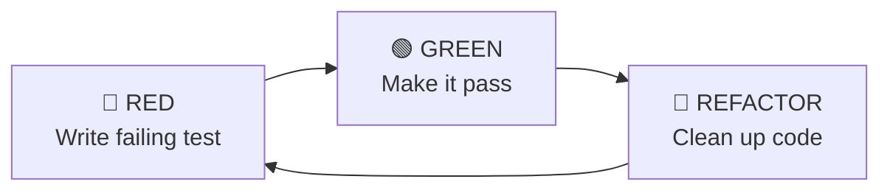

# TDD Example: Red-Green-Refactor

This example demonstrates the TDD cycle using a password validation function.

## Requirements

Write a function that validates a password:
- Must be longer than 8 characters
- Must contain at least one digit

## Step 1: Write First Test (RED)

Start with the simplest test — validate inputs:

```python
# tests/unit/test_password.py
import pytest
from mypackage.validation import validate_password


class TestValidatePassword:
    """Tests for validate_password function."""

    def test_null_input_raises(self) -> None:
        """Test that None input raises ValueError."""
        with pytest.raises(ValueError, match="input"):
            validate_password(None)
```

```python
# src/mypackage/validation.py
def validate_password(input: str | None) -> bool:
    """Validate password format."""
    return False  # Stub
```

**Run tests:** ❌ FAIL — no exception raised. This is expected! This is the **RED** phase.

## Step 2: Make Test Pass (GREEN)

Make the minimal change to pass the test:

```python
# src/mypackage/validation.py
def validate_password(input: str | None) -> bool:
    """Validate password format."""
    if input is None:
        raise ValueError("input cannot be None")
    return False
```

**Run tests:** ✅ PASS — but the function always returns `False`. That's okay for now!

## Step 3: Add Negative Test for Length (RED)

```python
def test_small_size_returns_false(self) -> None:
    """Test that short passwords return False."""
    assert validate_password("abc") is False
```

**Run tests:** ✅ Still passes (returns `False` for everything). Add the positive test:

## Step 4: Add Positive Test for Length (RED)

```python
def test_right_size_returns_true(self) -> None:
    """Test that valid-length passwords with digits return True."""
    assert validate_password("abcdefgh1") is True  # Note: includes digit for future
```

**Run tests:** ❌ FAIL — returns `False` instead of `True`.

## Step 5: Implement Length Check (GREEN)

```python
def validate_password(input: str | None) -> bool:
    """Validate password format."""
    if input is None:
        raise ValueError("input cannot be None")
    if len(input) > 8:
        return True
    return False
```

**Run tests:** ✅ PASS — but logic is inverted. Time to refactor!

## Step 6: Refactor

```python
def validate_password(input: str | None) -> bool:
    """Validate password format."""
    if input is None:
        raise ValueError("input cannot be None")
    if len(input) < 8:
        return False
    return True
```

**Run tests:** ✅ Still passes. Logic is cleaner.

## Step 7: Add Digit Requirement (RED)

```python
def test_valid_length_no_digit_returns_false(self) -> None:
    """Test that passwords without digits return False."""
    assert validate_password("abcdefghij") is False
```

**Run tests:** ❌ FAIL — returns `True` (only checks length).

## Step 8: Implement Digit Check (GREEN)

```python
def validate_password(input: str | None) -> bool:
    """Validate password format."""
    if input is None:
        raise ValueError("input cannot be None")
    if len(input) < 8:
        return False
    if not any(c.isdigit() for c in input):
        return False
    return True
```

**Run tests:** ✅ PASS

## Step 9: Final Refactor

```python
def validate_password(input: str | None) -> bool:
    """Validate password meets security requirements.

    Args:
        input: The password string to validate.

    Returns:
        True if password is valid, False otherwise.

    Raises:
        ValueError: If input is None.
    """
    if input is None:
        raise ValueError("input cannot be None")

    if len(input) < 8 or not any(c.isdigit() for c in input):
        return False

    return True
```

**Run tests:** ✅ All 4 tests pass with 100% coverage.

## Final Test Suite

```python
# tests/unit/test_password.py
import pytest
from mypackage.validation import validate_password


class TestValidatePassword:
    """Tests for validate_password function."""

    def test_null_input_raises(self) -> None:
        """Test that None input raises ValueError."""
        with pytest.raises(ValueError, match="input"):
            validate_password(None)

    def test_small_size_returns_false(self) -> None:
        """Test that short passwords return False."""
        assert validate_password("abc") is False

    def test_right_size_returns_true(self) -> None:
        """Test that valid passwords return True."""
        assert validate_password("abcdefgh1") is True

    def test_valid_length_no_digit_returns_false(self) -> None:
        """Test that passwords without digits return False."""
        assert validate_password("abcdefghij") is False
```

## Key Takeaways

1. **Write one test at a time** — Don't write all tests upfront
2. **Make minimal changes** — Only write enough code to pass the current test
3. **Refactor with confidence** — 100% coverage means safe refactoring
4. **Negative tests first** — Write tests for invalid inputs before valid ones
5. **Tests are forward-looking** — Include future requirements in test data (e.g., digit in valid password)

## The Red-Green-Refactor Cycle



Each cycle should take **minutes, not hours**. If you're stuck in RED for too long, the test may be too ambitious — break it down.

## References

- [Microsoft Engineering Playbook - TDD Example](https://microsoft.github.io/code-with-engineering-playbook/automated-testing/unit-testing/tdd-example/)
