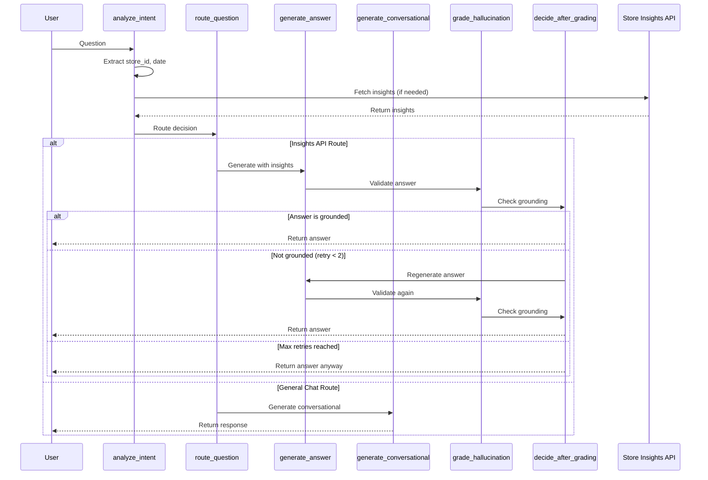

# 🏪 Store Insights AI

Store Insights AI is an intelligent chatbot that answers questions about store performance, inventory, and operations using natural language. It automatically:

- **Extracts entities** (store IDs, dates) from user questions
- **Routes queries** to the appropriate handler (API lookup or conversational)
- **Retrieves relevant insights** from an external Store Insights API
- **Generates contextual answers** using Azure OpenAI/OpenAI
- **Caches responses** for 24 hours to optimize performance

## 🏗️ Architecture

### LangGraph Workflow (Detailed)



### Node Descriptions

| Node | Purpose | Input | Output |
|------|---------|-------|--------|
| **analyze_intent** | Extract store_id, date from question; retrieve insights from API | User question | Extracted parameters + insights |
| **route_question** | Decide if query needs insights API or general chat | Question + extracted data | Route decision |
| **generate_answer** | Generate RAG-based answer using insights | Question + insights | Generated answer |
| **generate_conversational** | Handle greetings, help, and general questions | Question | Conversational response |
| **grade_hallucination** | Verify answer is grounded in provided insights | Answer + insights | Grounding score |
| **decide_after_grading** | Retry if not grounded (max 2 attempts) | Grounding score + iteration count | END or retry |

### Key Features

- ✅ **Automatic Entity Extraction**: Extracts store IDs and dates from natural language
- ✅ **Intelligent Routing**: Determines if query needs data lookup or conversational response
- ✅ **Quality Control**: Hallucination grading with automatic retry (max 2 attempts)
- ✅ **Stateful Conversations**: LangGraph checkpointer enables multi-turn conversations
- ✅ **Structured Outputs**: All LLM responses use Pydantic models for reliability

## 📦 Installation

### Prerequisites
- Python 3.11+
- pip or poetry
- Azure OpenAI API key (or OpenAI API key)
- Access to Store Insights API

### Setup

1. **Clone the repository**
   ```bash
   git clone <repository-url>
   cd store_insights_ai
   ```

2. **Create virtual environment**
   ```bash
   python -m venv .venv
   # Windows
   .venv\Scripts\activate
   # Linux/Mac
   source .venv/bin/activate
   ```

3. **Install dependencies**
   ```bash
   pip install -r requirements.txt
   ```

4. **Configure environment variables**
   ```bash
   cp .env.example .env
   # Edit .env with your credentials and values
   ```

## 🚀 Usage

### Running the API

Start the FastAPI server:

```bash
# Development mode with auto-reload
uvicorn app.api.api:app --reload --host 0.0.0.0 --port 8000

# Production mode
uvicorn app.api.api:app --host 0.0.0.0 --port 8000 --workers 4
```

The API will be available at:
- API: http://localhost:8000
- Interactive Docs: http://localhost:8000/docs
- ReDoc: http://localhost:8000/redoc

### Running the UI

Start the Streamlit interface:

```bash
cd ui
streamlit run app.py
```

The UI will open at http://localhost:8501

### API Endpoints

#### Health Check
```bash
GET /v1/api/health
```

**Response:**
```json
{
  "status": "healthy"
}
```

#### Chat - Ask Question
```bash
POST /v1/api/chat/ask
```

**Request:**
```json
{
  "question": "What are the sales for store 100?"
}
```

**Response:**
```json
{
  "answer": "Store 100 had total sales of $150,000 with 1,200 transactions...",
  "metadata": {
    "store_id": 100,
    "date": "2024-10-09",
    "route": "insights_api"
  },
  "sources": [
    {
      "type": "recommendation",
      "store_id": 100,
      "title": "Sales Performance",
      "text": "Store 100 showed strong performance...",
      "metadata": {}
    }
  ]
}
```

#### Get Insights (Direct)
```bash
GET /v1/api/insights?store_id=100&date=2024-10-09
```

**Response:**
```json
{
  "items": [
    {
      "id": "rec-123",
      "store_id": "100",
      "type": "recommendation",
      "title": "Inventory Alert",
      "text": "Consider restocking high-demand items...",
      "score": 0.95
    }
  ]
}
```

## 📄 License

MIT License - See LICENSE file for details

## 🤝 Contributing

1. Fork the repository
2. Create a feature branch (`git checkout -b feature/amazing-feature`)
3. Commit your changes (`git commit -m 'Add amazing feature'`)
4. Push to the branch (`git push origin feature/amazing-feature`)
5. Open a Pull Request
